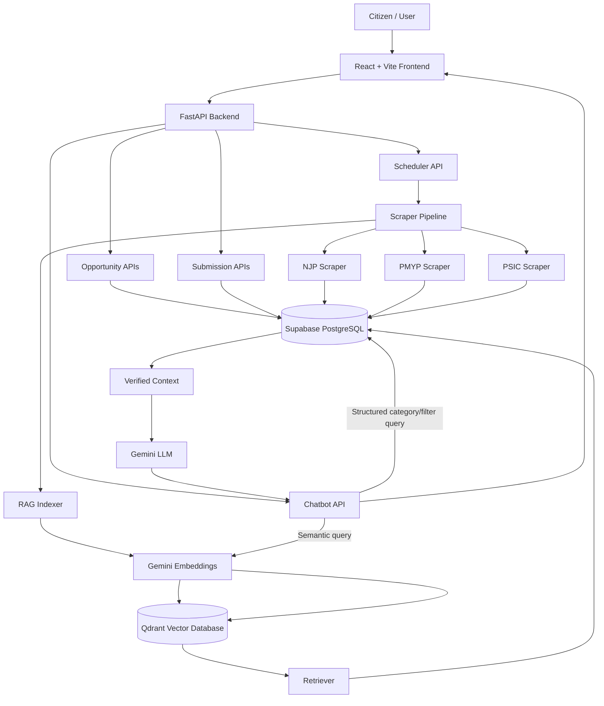

# 🇵🇰 Citizen Portal

A full-stack Pakistani citizen opportunity discovery platform that brings **jobs, scholarships, loans, training programs, internships, and projects** into one searchable portal. The system combines web scraping, Supabase, FastAPI, React, scheduled data collection, and an AI-powered semantic chatbot using **Google Gemini embeddings + Qdrant**.

> **Project status:** Active development

---

## 📌 Overview

Citizen Portal is designed to solve a common problem: important public opportunities are distributed across different government and institutional websites, making them difficult for citizens to discover and compare.

The platform provides:

- Centralized opportunity discovery
- Category-based browsing
- Search and filtering
- Province/location-based filtering
- Opportunity details and direct application links
- Bookmarking on the frontend
- User-submitted opportunities with admin approval
- Automated scraping from supported sources
- Scheduled data updates
- AI chatbot for natural-language opportunity discovery
- Semantic search using Qdrant
- Verified database-backed answers for direct category requests
- English/Urdu interface support

---

## ✨ Main Features

### 1. Opportunity Discovery

Users can browse opportunities by:

- Jobs
- Scholarships
- Loans
- Training
- Internships
- Projects

Each opportunity can contain structured information such as:

- Title
- Organization/department/company
- Description
- Eligibility
- Province
- Location
- Posted date
- Closing/deadline date
- Source
- Apply link
- Additional source-specific attributes

The database keeps `extra_data` flexible so different sources can provide different attributes without requiring a database schema change for every new field.

### 2. Search & Filtering

The frontend supports opportunity discovery through search and filters. The system is designed to support filters such as:

- Category
- Province
- Location
- Opportunity title/details
- Other source-specific attributes

### 3. Bookmarks

Users can bookmark opportunities from the frontend. Browser `localStorage` is used for the current bookmark experience.

### 4. User Submitted Opportunities

Users can submit an opportunity instead of waiting for it to be scraped.

The intended workflow is:

```text
User submits basic opportunity information
        ↓
Submission stored as pending
        ↓
Admin reviews submission
        ↓
Approve ───────────────→ Opportunity added to main database
   │
Reject
```

The submission form is intentionally lightweight. Known attributes can be entered by the user while additional information can be handled separately during the review/data-processing workflow.

### 5. Automated Web Scraping

The backend currently contains scrapers for supported opportunity sources including:

- **National Job Portal (NJP)** → jobs
- **PMYP** → scholarships
- **PSIC** → loans/projects and related supported data

The scraper pipeline collects source data, converts it into the portal's database format, and saves it to Supabase.

### 6. Scheduled Data Collection

APScheduler is integrated into the FastAPI application.

The scheduler runs in the `Asia/Karachi` timezone and can be configured using:

```env
SCRAPER_SCHEDULE_HOUR=8
SCRAPER_SCHEDULE_MINUTE=0
```

The default schedule is **08:00 Pakistan time**.

A manual scraper trigger is also available through the backend scheduler API.

### 7. AI Chatbot

Citizen Portal includes an AI assistant that can understand natural-language questions such as:

```text
Give me jobs
Give me 5 latest jobs
Give me 1 latest project
Latest scholarships
Jobs in Punjab
Jobs in Lahore
Software engineering jobs
```

The chatbot uses two retrieval strategies:

#### Direct structured requests

Simple category/filter requests use **Supabase as the source of truth**. This avoids unnecessary LLM generation and preserves exact titles, deadlines, and application links.

#### Semantic requests

More natural or meaning-based questions use:

```text
User question
   ↓
Gemini embedding
   ↓
Qdrant semantic search
   ↓
Matching opportunity IDs/data
   ↓
Supabase verified records
   ↓
Gemini answer generation
```

Gemini is instructed to answer only from verified retrieved context and not invent opportunity information.

---

# 🏗️ System Architecture



### Architecture Responsibilities

| Component | Responsibility |
|---|---|
| React + Vite | User interface and client-side interactions |
| FastAPI | Backend API and application orchestration |
| Supabase/PostgreSQL | Primary/source-of-truth opportunity database |
| Scrapers | Collect opportunity information from external websites |
| APScheduler | Automated scheduled scraper execution |
| Gemini Embeddings | Converts opportunity/query text into vectors |
| Qdrant | Semantic/vector search index |
| Gemini LLM | Generates grounded natural-language chatbot answers |
| Browser localStorage | Current frontend bookmark persistence |

---

# 🔄 Data Flow

## Scraper → Database → RAG

```text
External Opportunity Website
          ↓
       Scraper
          ↓
   Data Normalization
          ↓
       Supabase
          ↓
     RAG Indexer
          ↓
 Gemini Embedding Model
          ↓
       Qdrant
```

## Chatbot Flow

### Exact/structured request

```text
User: "Give me 5 latest jobs in Punjab"
                    ↓
          FastAPI Chatbot Route
                    ↓
       Detect category + filters
                    ↓
              Supabase
                    ↓
       Filter + sort + limit
                    ↓
          Verified response
```

### Semantic request

```text
User question
      ↓
Gemini embedding
      ↓
Qdrant similarity search
      ↓
Relevant opportunity IDs
      ↓
Supabase records
      ↓
Verified context
      ↓
Gemini LLM
      ↓
Natural-language answer
```

**Important:** Qdrant is a semantic search/index layer. Supabase remains the authoritative database for opportunity records.

---

# 📁 Project Structure

```text
Citizen_Portal/
│
├── backend/
│   ├── app/
│   │   ├── api/
│   │   │   └── routes/
│   │   │       ├── chatbot.py
│   │   │       ├── opportunities.py
│   │   │       ├── submitted_opportunities.py
│   │   │       └── scraper_scheduler.py
│   │   │
│   │   ├── core/
│   │   │   └── database.py
│   │   │
│   │   ├── models/
│   │   │
│   │   ├── rag/
│   │   │   ├── gemini.py
│   │   │   ├── qdrant.py
│   │   │   ├── retriever.py
│   │   │   └── indexer.py
│   │   │
│   │   ├── scheduler/
│   │   │   ├── scheduler.py
│   │   │   └── jobs.py
│   │   │
│   │   ├── scrapers/
│   │   │   ├── loader.py
│   │   │   ├── njp_scraper.py
│   │   │   ├── pmyp_scraper.py
│   │   │   └── psic_loan_scraper.py
│   │   │
│   │   └── main.py
│   │
│   └── requirements.txt
│
├── frontend/
│   ├── src/
│   │   ├── components/
│   │   ├── screens/
│   │   ├── services/
│   │   └── ...
│   ├── package.json
│   └── vite.config.*
│
├── docs/
├── .gitignore
└── README.md
```

---

# 🛠️ Technology Stack

## Frontend

- React 19
- Vite
- Tailwind CSS
- Lucide React
- React i18next / i18next
- Supabase JavaScript client

## Backend

- Python
- FastAPI
- Uvicorn
- Pydantic
- Requests
- BeautifulSoup4
- APScheduler

## Database & AI

- Supabase / PostgreSQL
- Google Gemini API
- Gemini Embeddings
- Qdrant Vector Database

The backend dependency list includes FastAPI, Uvicorn, Supabase, Pydantic, BeautifulSoup4, Requests, APScheduler, Google GenAI, and Qdrant Client. 

---

# ✅ Requirements

Before running the project, install:

- Python 3.10+ recommended
- Node.js 18+ recommended
- npm
- A Supabase project
- A Google Gemini API key
- A Qdrant instance/cloud collection for semantic search
- Git

---

# 🚀 Installation & Setup

## 1. Clone the Repository

```bash
git clone https://github.com/SairaSaeed824/Citizen_Portal.git
cd Citizen_Portal
```

---

## 2. Backend Setup

Open a terminal in the backend directory:

```powershell
cd backend
```

Create a virtual environment:

```powershell
python -m venv venv
```

Activate it on Windows:

```powershell
venv\Scripts\activate
```

Install dependencies:

```powershell
pip install -r requirements.txt
```

---

## 3. Backend Environment Variables

Create:

```text
backend/.env
```

Add your environment configuration:

```env
SUPABASE_URL=your_supabase_project_url
SUPABASE_KEY=your_supabase_key

GEMINI_API_KEY=your_gemini_api_key
GEMINI_EMBEDDING_MODEL=gemini-embedding-001
GEMINI_CHAT_MODEL=gemini-2.5-flash

QDRANT_URL=your_qdrant_url
QDRANT_API_KEY=your_qdrant_api_key
QDRANT_COLLECTION=citizen_opportunities

SCRAPER_SCHEDULE_HOUR=8
SCRAPER_SCHEDULE_MINUTE=0
```

### Security

Never commit `.env` files or API keys to GitHub.

If a secret is accidentally committed, revoke/rotate it immediately and remove it from the repository history where appropriate.

---

# ▶️ Run the Backend

From:

```text
Citizen_Portal/backend
```

run:

```powershell
uvicorn app.main:app --reload
```

The backend normally starts at:

```text
http://127.0.0.1:8000
```

FastAPI interactive documentation:

```text
http://127.0.0.1:8000/docs
```

Alternative ReDoc documentation:

```text
http://127.0.0.1:8000/redoc
```

Root health endpoint:

```text
GET /
```

Expected response:

```json
{
  "message": "Citizen Portal API is running"
}
```

---

# ▶️ Run the Frontend

Open a second terminal:

```powershell
cd frontend
```

Install packages:

```powershell
npm install
```

Start Vite:

```powershell
npm run dev
```

The frontend is normally available at:

```text
http://localhost:5173
```

---

# 🧪 Useful Development Commands

## Frontend

```bash
npm run dev
npm run build
npm run lint
npm run preview
```

## Backend

```powershell
uvicorn app.main:app --reload
```

## Run an individual scraper

Example for NJP:

```powershell
python -m app.scrapers.njp_scraper
```

The exact scraper entry point can vary depending on the scraper implementation.

---

# 🕷️ Scraper Pipeline

The central scheduler job runs the supported scrapers and then refreshes the RAG index.

```text
APScheduler
    ↓
run_all_scrapers()
    ↓
┌───────────────┬────────────────┬────────────────┐
│ NJP Scraper   │ PMYP Scraper   │ PSIC Scraper   │
└───────┬───────┴────────┬───────┴────────┬───────┘
        ↓                 ↓                ↓
              Normalize / Save
                     ↓
                  Supabase
                     ↓
               RAG Indexer
                     ↓
                  Qdrant
```

The scraper job is designed so that scraper execution and RAG indexing are separated: opportunities are first saved to Supabase, after which the current opportunity dataset is passed to the RAG indexer.

---

# 🤖 RAG & AI Architecture

Citizen Portal uses Retrieval-Augmented Generation (RAG) rather than allowing the LLM to answer from general knowledge.

### Embedding

Opportunity information is converted into a vector using Gemini embeddings.

```text
Opportunity text
      ↓
Gemini Embedding Model
      ↓
Vector
      ↓
Qdrant
```

### Retrieval

```text
User query
    ↓
Gemini Embedding
    ↓
Qdrant similarity search
    ↓
Relevant opportunities
```

### Grounded answer generation

```text
Retrieved opportunities
        ↓
Build verified context
        ↓
Gemini LLM
        ↓
Answer based only on context
```

This design reduces hallucination risk because the chatbot is explicitly instructed not to invent eligibility, deadlines, organizations, fees, links, or requirements.

---

# 🗄️ Data Model Concept

The main `opportunities` table is the source of truth.

Conceptually, an opportunity contains:

```text
opportunities
├── id
├── title
├── category
├── description
├── extra_data
├── created_at
└── ...
```

`extra_data` is used for source-specific/dynamic attributes such as:

```json
{
  "organization": "Example Organization",
  "province": "Punjab",
  "location": "Lahore",
  "posted_date": "2026-09-01",
  "closing_date": "2026-09-30",
  "apply_link": "https://example.com/apply",
  "source": "Example Source"
}
```

The exact database schema should be kept synchronized with the Supabase project used by the deployment.

---

# 🔌 API Overview

The FastAPI application currently exposes route groups for:

### Opportunities

Used for retrieving and working with published opportunities.

### Submitted Opportunities

Used for user submissions and the admin approval workflow.

### Scraper Scheduler

Used for scheduler/manual scraper operations.

### Chatbot

Main chatbot endpoint:

```text
POST /api/chatbot/chat
```

Example request:

```json
{
  "message": "Give me 5 latest jobs in Punjab",
  "limit": 8
}
```

The chatbot can internally determine the requested count, category, latest sorting, province/location filters, and search terms for supported structured requests.

For complete endpoint details, run the backend and open `/docs`.

---

# 🧠 Example Chatbot Queries

| User Query | Expected Behavior |
|---|---|
| `give me jobs` | Returns job opportunities |
| `give me 5 latest jobs` | Returns exactly 5 latest jobs when available |
| `give me 1 latest project` | Returns exactly 1 latest project when available |
| `latest scholarships` | Returns latest scholarships |
| `jobs in Punjab` | Filters jobs by Punjab |
| `jobs in Lahore` | Filters jobs by Lahore |
| `software engineering jobs` | Uses relevant title/details matching |
| `AI opportunities for students` | Suitable semantic retrieval can use Qdrant + Gemini |

---

# 🔐 Security Considerations

- Keep Supabase and Gemini credentials in environment variables.
- Do not commit `.env` files.
- Do not expose server-side Supabase service credentials in frontend code.
- Do not expose Qdrant API keys in the browser.
- Validate user-submitted opportunity data before publishing.
- Keep admin approval separate from public opportunity creation.
- Treat scraped external content as untrusted input.
- Sanitize/render external text safely in the frontend.

---

# 📈 Production Deployment Considerations

For production, the recommended architecture is:

```text
                    Internet
                       │
              ┌────────▼────────┐
              │ Production FE   │
              │ React/Vite      │
              └────────┬────────┘
                       │ HTTPS
              ┌────────▼────────┐
              │ FastAPI API     │
              │ Production Host │
              └───────┬─────────┘
                      │
       ┌──────────────┼─────────────────┐
       ↓              ↓                 ↓
   Supabase        Qdrant           Gemini API
       ↑
       │
 Scraper/Scheduler Worker
```

### Important production note

The current scheduler is started from the FastAPI application lifecycle. If the API is deployed with multiple worker processes or multiple application instances, each process can potentially start its own scheduler.

For a production deployment with multiple replicas, move scheduled scraping into a **single dedicated worker/cron job** or otherwise guarantee one scheduler instance.

This prevents duplicate scraping and duplicate indexing.

---

# 🩺 Troubleshooting

## Backend does not start

Check that the virtual environment is activated:

```powershell
venv\Scripts\activate
```

Then reinstall dependencies:

```powershell
pip install -r requirements.txt
```

Check that `.env` contains valid Supabase credentials.

---

## Supabase connection error

Verify:

```env
SUPABASE_URL=...
SUPABASE_KEY=...
```

The backend reads these variables when initializing the Supabase client.

---

## Gemini error

Verify:

```env
GEMINI_API_KEY=...
```

Also verify that the configured model names are available for the Gemini API project being used.

---

## Qdrant error

Verify:

```env
QDRANT_URL=...
QDRANT_API_KEY=...
```

The default collection name is:

```text
citizen_opportunities
```

---

## Frontend cannot connect to backend

Make sure both servers are running:

```text
Frontend → http://localhost:5173
Backend  → http://127.0.0.1:8000
```

Also verify the frontend API configuration and FastAPI CORS settings.

---

## Scraper returns no data

Possible causes include:

- Source website changed its HTML structure
- Network/request failure
- Anti-bot protection
- Selector changes
- Invalid source URL
- Source temporarily unavailable
- Date/field format changed

Inspect scraper logs and test the scraper independently before debugging the database or frontend.

---

# 🧪 Testing Checklist

Before considering a local build ready:

### Backend

- [ ] FastAPI starts without errors
- [ ] `/` responds successfully
- [ ] `/docs` loads
- [ ] Supabase connection works
- [ ] Opportunity API returns records
- [ ] Submission API works
- [ ] Chatbot endpoint responds
- [ ] Scheduler starts without duplicate jobs

### Scrapers

- [ ] NJP scraper runs
- [ ] PMYP scraper runs
- [ ] PSIC scraper runs
- [ ] Data is normalized correctly
- [ ] Deadlines are stored correctly
- [ ] Apply links are valid
- [ ] Duplicate records are handled

### RAG

- [ ] Qdrant connection works
- [ ] Collection is created/available
- [ ] Embeddings are generated
- [ ] New opportunities are indexed
- [ ] Semantic search returns relevant records
- [ ] Gemini answers only from retrieved context

### Frontend

- [ ] Opportunities load
- [ ] Search works
- [ ] Filters work
- [ ] Category navigation works
- [ ] Opportunity details open
- [ ] Apply links work
- [ ] Bookmarks work
- [ ] Urdu/English switching works
- [ ] Chatbot works
- [ ] Mobile layout is usable

---

# 🌱 Future Improvements

Potential future enhancements include:

- Dedicated production scraper worker
- Better duplicate detection across sources
- Improved province/location normalization
- More robust date normalization
- More source integrations
- Admin dashboard improvements
- User authentication and profiles
- Server-side bookmark synchronization
- Advanced semantic + structured hybrid ranking
- Analytics and opportunity popularity metrics
- Automated scraper monitoring and alerts
- Automated tests and CI/CD
- Production logging and observability

---

# 👩‍💻 Development Notes

The project follows a layered architecture:

```text
Frontend
   ↓
API Routes
   ↓
Business/Data Logic
   ↓
Supabase / RAG / External Sources
```

The backend separates API routes, core configuration/database access, scrapers, scheduler jobs, and RAG functionality to keep the project maintainable as more opportunity sources and AI features are added.

---

# 📄 License

Add the project's chosen license here before publishing the repository as an open-source project.

---

# 🙌 Acknowledgement

Citizen Portal is built as a practical full-stack + AI project focused on making Pakistani public opportunities easier to discover, search, and access from one platform.
