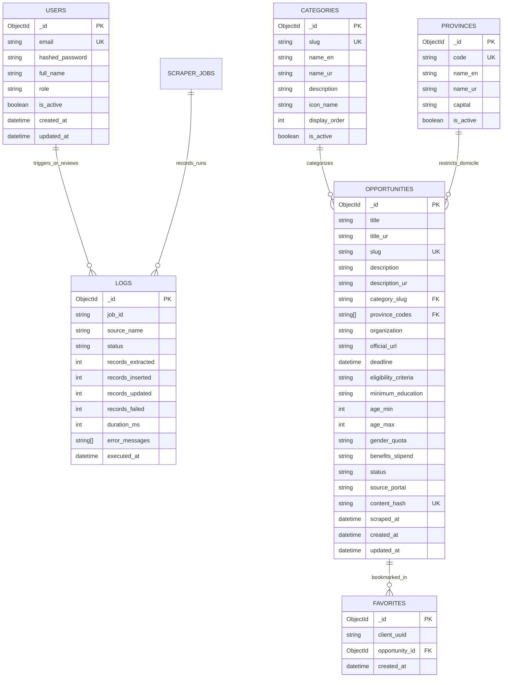

# Database Schema & Data Models Specification

## 1. Overview & Architecture

The **Citizen Opportunities Portal** utilizes **MongoDB Atlas** (v7.0+) as its primary multi-collection document database, coupled with **Upstash Redis** for cache and transient rate-limiting data.

### 1.1 Entity Relationship Model



---

## 2. Detailed Collection Schemas

### 2.1 Collection: `users`
Stores administrative accounts responsible for portal moderation, manual data curation, and scraper control.

| Field Name | BSON Type | Nullable | Unique | Description / Validation |
|---|---|---|---|---|
| `_id` | `ObjectId` | No | Yes | Primary key auto-generated by MongoDB. |
| `email` | `String` | No | Yes | Lowercase, valid RFC 5322 email string. |
| `hashed_password` | `String` | No | No | Passlib Bcrypt hashed password string (`$2b$12$...`). |
| `full_name` | `String` | No | No | Full name (3 to 60 characters). |
| `role` | `String` | No | No | Enum: `SUPER_ADMIN`, `MODERATOR`. |
| `is_active` | `Boolean` | No | No | Boolean flag controlling login access. Default: `true`. |
| `created_at` | `Date` | No | No | UTC timestamp of account creation. |
| `updated_at` | `Date` | No | No | UTC timestamp of last profile update. |

#### MongoDB Indexes
```javascript
db.users.createIndex({ "email": 1 }, { unique: true });
db.users.createIndex({ "role": 1, "is_active": 1 });
```

#### Sample JSON Document
```json
{
  "_id": { "$oid": "65de1001a1b2c3d4e5f60001" },
  "email": "admin@citizenportal.gov.pk",
  "hashed_password": "$2b$12$e8YQe5oTfO9qB5d0Q1xTdeC3H6bZ6yH7j0N.8wE7q0rCq6mFq5.Ke",
  "full_name": "Muhammad Usman Khan",
  "role": "SUPER_ADMIN",
  "is_active": true,
  "created_at": { "$date": "2026-01-15T08:00:00.000Z" },
  "updated_at": { "$date": "2026-08-28T06:30:00.000Z" }
}
```

---

### 2.2 Collection: `categories`
Stores the official five sectors and sub-classifications for opportunities.

| Field Name | BSON Type | Nullable | Unique | Description / Validation |
|---|---|---|---|---|
| `_id` | `ObjectId` | No | Yes | Primary key. |
| `slug` | `String` | No | Yes | URL-safe identifier (`jobs`, `scholarships`, `internships`, `loans`, `training`). |
| `name_en` | `String` | No | No | English display name. |
| `name_ur` | `String` | No | No | Urdu display name in Unicode. |
| `description` | `String` | Yes | No | Detailed sector description. |
| `icon_name` | `String` | No | No | Lucide icon identifier (e.g. `GraduationCap`, `Briefcase`). |
| `display_order` | `Int32` | No | No | Priority integer for UI ordering. |
| `is_active` | `Boolean` | No | No | Active status toggle. Default: `true`. |

#### MongoDB Indexes
```javascript
db.categories.createIndex({ "slug": 1 }, { unique: true });
db.categories.createIndex({ "display_order": 1 });
```

#### Sample Seed Document
```json
{
  "_id": { "$oid": "65de1002a1b2c3d4e5f60002" },
  "slug": "scholarships",
  "name_en": "Scholarships",
  "name_ur": "وظائف و سکالرشپس",
  "description": "National and international undergraduate, graduate, and post-doctoral financial grants.",
  "icon_name": "GraduationCap",
  "display_order": 1,
  "is_active": true
}
```

---

### 2.3 Collection: `provinces`
Stores Pakistani administrative units and domicile scopes.

| Field Name | BSON Type | Nullable | Unique | Description / Validation |
|---|---|---|---|---|
| `_id` | `ObjectId` | No | Yes | Primary key. |
| `code` | `String` | No | Yes | Code identifier (`PUNJAB`, `SINDH`, `KPK`, `BALOCHISTAN`, `GB`, `AJK`, `FEDERAL`). |
| `name_en` | `String` | No | No | English region name. |
| `name_ur` | `String` | No | No | Urdu region name in Unicode. |
| `capital` | `String` | No | No | Administrative capital city. |
| `is_active` | `Boolean` | No | No | Active status. Default: `true`. |

#### MongoDB Indexes
```javascript
db.provinces.createIndex({ "code": 1 }, { unique: true });
```

#### Sample Seed Document
```json
{
  "_id": { "$oid": "65de1003a1b2c3d4e5f60003" },
  "code": "KPK",
  "name_en": "Khyber Pakhtunkhwa",
  "name_ur": "خیبر پختونخوا",
  "capital": "Peshawar",
  "is_active": true
}
```

---

### 2.4 Collection: `opportunities`
The central data collection holding all validated government schemes.

| Field Name | BSON Type | Nullable | Unique | Validation / Rules |
|---|---|---|---|---|
| `_id` | `ObjectId` | No | Yes | Primary key. |
| `title` | `String` | No | No | Length: 10–100 characters. Clean string. |
| `title_ur` | `String` | Yes | No | Urdu title translation/summary. |
| `slug` | `String` | No | Yes | URL slug generated from title + short UUID. |
| `description` | `String` | No | No | Detailed scope, coverage, and instructions (20–5000 chars). |
| `description_ur` | `String` | Yes | No | Urdu translated description. |
| `category_slug` | `String` | No | No | Must match one active `categories.slug`. |
| `province_codes` | `Array[String]`| No | No | Array of valid province codes or `["ALL"]`. |
| `organization` | `String` | No | No | Issuing entity (e.g. `HEC`, `SMEDA`, `NAVTTC`). |
| `official_url` | `String` | No | No | Valid `https://` official application link. |
| `deadline` | `Date` | No | No | UTC timestamp. Must be > current date upon ingestion. |
| `eligibility_criteria` | `String` | No | No | Summary of eligibility conditions. |
| `minimum_education` | `String` | No | No | Enum: `Matric`, `Intermediate`, `Bachelors`, `Masters`, `PhD`, `None`. |
| `age_min` | `Int32` | Yes | No | Minimum age integer (e.g. 18). |
| `age_max` | `Int32` | Yes | No | Maximum age integer (e.g. 35). |
| `gender_quota` | `String` | No | No | Enum: `ALL`, `MALE_ONLY`, `FEMALE_ONLY`, `TRANSGENDER`. |
| `benefits_stipend` | `String` | Yes | No | Description of stipend, grant, or financial coverage. |
| `status` | `String` | No | No | Enum: `ACTIVE`, `EXPIRED`, `PENDING_REVIEW`, `ARCHIVED`. |
| `source_portal` | `String` | No | No | Source Enum: `HEC`, `NJP`, `BNIP`, `SMEDA`, `NAVTTC`, `YOUTH_AFFAIRS`, `MANUAL`. |
| `content_hash` | `String` | No | Yes | SHA-256 hash of `(title + official_url + deadline)` for deduplication. |
| `scraped_at` | `Date` | Yes | No | UTC timestamp of scraping. |
| `created_at` | `Date` | No | No | UTC timestamp of insertion. |
| `updated_at` | `Date` | No | No | UTC timestamp of modification. |

#### MongoDB Indexes
```javascript
// Unique deduplication index
db.opportunities.createIndex({ "content_hash": 1 }, { unique: true });
db.opportunities.createIndex({ "slug": 1 }, { unique: true });

// Compound query index for fast search & filtering
db.opportunities.createIndex({ "status": 1, "category_slug": 1, "deadline": 1 });
db.opportunities.createIndex({ "status": 1, "province_codes": 1, "deadline": 1 });

// Full-text search index
db.opportunities.createIndex(
  {
    "title": "text",
    "description": "text",
    "organization": "text",
    "title_ur": "text"
  },
  {
    weights: { "title": 10, "organization": 5, "description": 2, "title_ur": 8 },
    name: "opportunities_text_search_idx"
  }
);
```

#### Sample JSON Document
```json
{
  "_id": { "$oid": "65de1004a1b2c3d4e5f60004" },
  "title": "HEC Overseas Scholarship Scheme Phase-III 2026",
  "title_ur": "ایچ ای سی اوورسیز سکالرشپ سکیم فیز III",
  "slug": "hec-overseas-scholarship-phase-iii-2026-9f8a",
  "description": "Applications are invited from outstanding Pakistani/AJK nationals for the award of PhD and MS/MPhil leading to PhD scholarships in top 50 QS-ranked world universities.",
  "description_ur": "اعلیٰ تعلیمی کمیشن پاکستان کی جانب سے دنیا کی ٹاپ 50 یونیورسٹیوں میں پی ایچ ڈی کے لیے وظائف کا اعلان۔",
  "category_slug": "scholarships",
  "province_codes": ["PUNJAB", "SINDH", "KPK", "BALOCHISTAN", "GB", "AJK", "FEDERAL"],
  "organization": "Higher Education Commission (HEC)",
  "official_url": "https://www.hec.gov.pk/english/scholarships/overseas/phase3",
  "deadline": { "$date": "2026-10-31T23:59:59.000Z" },
  "eligibility_criteria": "Minimum 16 years of education (BS/MSc) with minimum 3.0 CGPA or 1st Division. Maximum age 35 years.",
  "minimum_education": "Bachelors",
  "age_min": 18,
  "age_max": 35,
  "gender_quota": "ALL",
  "benefits_stipend": "100% Tuition Fee, Monthly Living Allowance ($1,800/mo), Airfare, Health Insurance",
  "status": "ACTIVE",
  "source_portal": "HEC",
  "content_hash": "e3b0c44298fc1c149afbf4c8996fb92427ae41e4649b934ca495991b7852b855",
  "scraped_at": { "$date": "2026-08-28T04:00:00.000Z" },
  "created_at": { "$date": "2026-08-28T04:05:00.000Z" },
  "updated_at": { "$date": "2026-08-28T04:05:00.000Z" }
}
```

---

### 2.5 Collection: `favorites`
Stores user-saved bookmarks correlated to anonymous browser UUIDs or registered users.

| Field Name | BSON Type | Nullable | Unique | Description |
|---|---|---|---|---|
| `_id` | `ObjectId` | No | Yes | Primary key. |
| `client_uuid` | `String` | No | No | Anonymous client-generated UUIDv4 or User ID. |
| `opportunity_id` | `ObjectId` | No | No | Reference to `opportunities._id`. |
| `created_at` | `Date` | No | No | Timestamp of bookmarking. |

#### MongoDB Indexes
```javascript
db.favorites.createIndex({ "client_uuid": 1, "opportunity_id": 1 }, { unique: true });
db.favorites.createIndex({ "client_uuid": 1, "created_at": -1 });
```

---

### 2.6 Collection: `logs`
Maintains operational audit records for automated and manual scraper runs.

| Field Name | BSON Type | Nullable | Description |
|---|---|---|---|
| `_id` | `ObjectId` | No | Primary key. |
| `job_id` | `String` | No | Unique UUID for the scraper execution run. |
| `source_name` | `String` | No | Portal identifier (`HEC`, `NJP`, `BNIP`, `SMEDA`, `NAVTTC`, `YOUTH`). |
| `status` | `String` | No | Enum: `SUCCESS`, `PARTIAL_SUCCESS`, `FAILED`. |
| `records_extracted` | `Int32` | No | Raw total records discovered from HTML/DOM. |
| `records_inserted` | `Int32` | No | New records successfully validated & inserted. |
| `records_updated` | `Int32` | No | Existing records updated. |
| `records_failed` | `Int32` | No | Invalid/duplicate records rejected by validation pipeline. |
| `duration_ms` | `Int32` | No | Total run execution time in milliseconds. |
| `error_messages` | `Array[String]` | Yes | Array of error traces or rejection reasons. |
| `executed_at` | `Date` | No | UTC timestamp of run initiation. |

#### MongoDB Indexes
```javascript
db.logs.createIndex({ "source_name": 1, "executed_at": -1 });
db.logs.createIndex({ "status": 1, "executed_at": -1 });
```

#### Sample JSON Document
```json
{
  "_id": { "$oid": "65de1005a1b2c3d4e5f60005" },
  "job_id": "job-njp-20260828-040001",
  "source_name": "NJP",
  "status": "SUCCESS",
  "records_extracted": 45,
  "records_inserted": 12,
  "records_updated": 30,
  "records_failed": 3,
  "duration_ms": 14250,
  "error_messages": [
    "Row #14 skipped: deadline passed (2026-08-20)",
    "Row #29 skipped: title length < 10 characters ('Clerk')"
  ],
  "executed_at": { "$date": "2026-08-28T04:00:00.000Z" }
}
```
