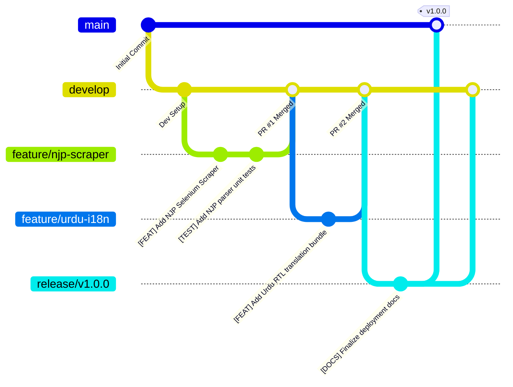

# Git Workflow, Branching Strategy & Contribution Guidelines

## 1. Branching Strategy (Git Flow Lite)

The **Citizen Opportunities Portal** repository adheres to a structured Git branching strategy designed for high release stability and continuous integration.



### 1.1 Branch Hierarchy

| Branch Name | Base Branch | Target Merge | Description | Protection Rules |
|---|---|---|---|---|
| `main` | - | - | Production-ready, fully tested releases. Deploys to Railway & Vercel production. | Protected. Requires PR review + passing CI. Direct push disabled. |
| `develop` | `main` | `main` | Active integration branch for sprint features. | Protected. Requires PR approval. |
| `feature/<name>` | `develop` | `develop` | New features (e.g. `feature/ai-chatbot`, `feature/redis-cache`). | Short-lived. Deleted after merge. |
| `fix/<name>` | `develop` | `develop` | Bug fixes on development features. | Short-lived. Deleted after merge. |
| `hotfix/<name>` | `main` | `main` & `develop`| Urgent critical fixes in production. | Requires fast-track peer review. |
| `docs/<name>` | `develop` | `develop` | Documentation improvements and technical guides. | Standard PR. |

---

## 2. Commit Message Standards

All commits must follow the **Conventional Commits** standard prefixed with an explicit category tag:

```text
[TAG] Brief imperative summary in present tense (max 60 chars)

Optional detailed multi-line explanation of the context, motivation,
and design decisions behind the code change.

Closes #ISSUE_NUMBER
```

### 2.1 Allowed Commit Tags

| Tag | Usage Scenario | Example |
|---|---|---|
| `[FEAT]` | A new feature or major capability added. | `[FEAT] Implement AI eligibility questionnaire endpoint` |
| `[FIX]` | A bug fix or error correction. | `[FIX] Correct HEC scraper date parsing for two-digit years` |
| `[DOCS]` | Documentation updates only. | `[DOCS] Add API endpoints specification and curl examples` |
| `[STYLE]` | Formatting, missing semi-colons, white-space fixes. | `[STYLE] Format backend codebase with black and isort` |
| `[REFACTOR]` | Code restructuring with no behavior change. | `[REFACTOR] Modularize Redux opportunity slices and actions` |
| `[TEST]` | Adding or modifying unit and integration test suites. | `[TEST] Add Pydantic validation unit tests for deadline check` |
| `[CHORE]` | Updating build tools, dependencies, or `.env` templates. | `[CHORE] Upgrade FastAPI to v0.109.0 and motor to v3.3.2` |

---

## 3. Step-by-Step Feature Workflow

### Step 1: Sync and Branch
```bash
# Ensure local develop branch is updated
git checkout develop
git pull origin develop

# Create a descriptive feature branch
git checkout -b feature/smeda-scraper-integration
```

### Step 2: Make Changes & Test Locally
```bash
# Run backend test suite
pytest tests/

# Run frontend linting & build verification
cd frontend
npm run lint
npm run build
```

### Step 3: Stage and Commit
```bash
git add scrapers/smeda_scraper.py tests/test_scrapers.py
git commit -m "[FEAT] Integrate SMEDA business loan scraper and parser"
```

### Step 4: Push and Open Pull Request
```bash
git push -u origin feature/smeda-scraper-integration
```

---

## 4. Pull Request (PR) Template & Checklist

When opening a Pull Request on GitHub, complete the following verification checklist:

```markdown
## Description
Brief summary of the changes introduced in this PR.

## Type of Change
- [ ] [FEAT] New feature (non-breaking change adding functionality)
- [ ] [FIX] Bug fix (non-breaking change fixing an issue)
- [ ] [REFACTOR] Code refactoring
- [ ] [DOCS] Documentation update
- [ ] [TEST] Adding missing tests

## Verification & Quality Checklist
- [ ] My code adheres to the project's **CODING_STANDARDS.md**.
- [ ] I have performed a self-review of my code.
- [ ] No sensitive credentials, API keys, or `.env` files are included.
- [ ] Unit tests pass with `pytest tests/` and `npm run test`.
- [ ] Bilingual support (Urdu & English) remains functional if UI was modified.
- [ ] MongoDB indexes or schema migrations have been documented if applicable.

## Related Issues
Closes #12
```

---

## 5. Release & Versioning Policy

The project uses **Semantic Versioning (`MAJOR.MINOR.PATCH`)**:
- `MAJOR` (v1.0.0, v2.0.0): Incompatible API or database schema changes.
- `MINOR` (v1.1.0, v1.2.0): New backward-compatible features and scrapers.
- `PATCH` (v1.0.1, v1.0.2): Backward-compatible bug fixes and security patches.

### Creating a Release Tag
```bash
git checkout main
git pull origin main
git tag -a v1.0.0 -m "Release v1.0.0: Initial production release of Citizen Opportunities Portal"
git push origin v1.0.0
```
