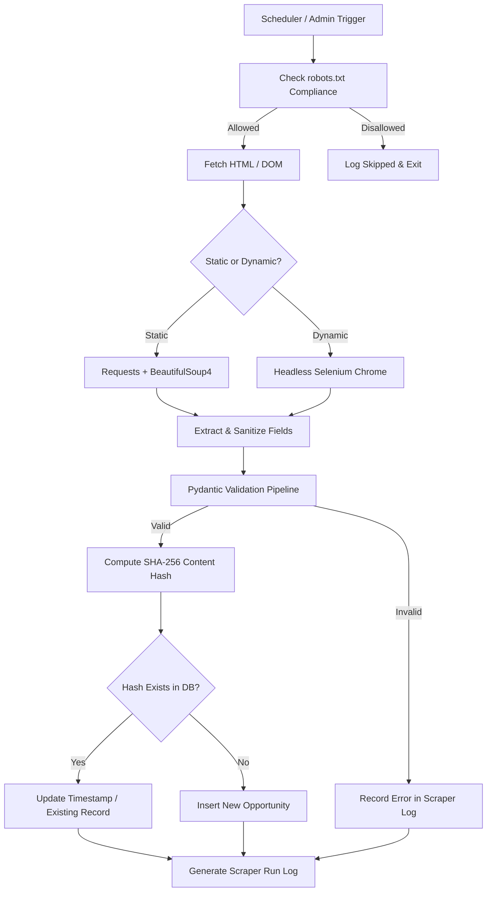

# Web Scraper Architecture, Guidelines & Implementation

## 1. Ethical & Technical Compliance Rules

All scraping modules in the **Citizen Opportunities Portal** must strictly abide by ethical data harvesting standards and legal compliance policies:

1. **Robots.txt Verification:** Always parse and respect `robots.txt` rules of target domains prior to launching crawl jobs.
2. **Custom User-Agent:** Never use default `python-requests` or generic headers. Identify the scraper bot transparently with contact metadata.
3. **Polite Request Throttling:** Enforce a strict delay of **2.0 to 3.5 seconds** between successive HTTP requests to any single domain.
4. **Rate Limit & Error Handling:** Handle HTTP `429 (Too Many Requests)` and `403 (Forbidden)` with exponential backoff and circuit breaking.
5. **Deduplication:** Generate SHA-256 content hashes for all parsed records before attempting database writes to prevent redundant DB writes.
6. **No Aggressive Parallelism:** Concurrency is strictly limited to 1 worker per domain.

---

## 2. Target Data Sources & Crawl Frequencies

| Source # | Portal Name | Domain URL | Data Harvested | Primary Scraper Tool | Crawl Frequency |
|---|---|---|---|---|---|
| 1 | **HEC Scholarships** | `https://www.hec.gov.pk/` | Foreign & National scholarships, PhD grants | BeautifulSoup4 + Requests | Weekly (Every Sunday 02:00 PKT) |
| 2 | **NJP Jobs** | `https://www.njp.gov.pk/` | Federal civil vacancies & contract positions | Selenium (Headless Chrome) | Daily (03:00 PKT) |
| 3 | **BNIP Internships** | `https://bnip.gov.pk/` | Paid youth internships & stipends | Selenium (Headless Chrome) | Weekly (Every Monday 04:00 PKT) |
| 4 | **SMEDA Loans** | `https://www.smeda.org/` | Micro-enterprise loans & grants | BeautifulSoup4 + Requests | Monthly (1st of month 01:00 PKT) |
| 5 | **NAVTTC Training** | `https://www.navttc.org/` | High-tech & vocational certifications | BeautifulSoup4 + Requests | Weekly (Every Friday 02:00 PKT) |
| 6 | **Youth Affairs** | `https://youthaffairs.gov.pk/` | Prime Minister's Youth Initiatives | BeautifulSoup4 + Requests | Bi-Weekly (1st & 15th 05:00 PKT) |

---

## 3. Base Scraper Architecture

Every portal scraper inherits from `BaseScraper`, which encapsulates rate limiting, user-agent rotation, error logging, and standard hash deduplication.



---

## 4. Implementation Code

### 4.1 Base Scraper Class (`backend/scrapers/base.py`)

```python
import hashlib
import logging
import time
import urllib.robotparser
from abc import ABC, abstractmethod
from datetime import datetime, timezone
from typing import Any, Dict, List, Optional
import requests

logging.basicConfig(level=logging.INFO)
logger = logging.getLogger("ScraperEngine")

class BaseScraper(ABC):
    def __init__(self, source_name: str, base_url: str, delay_seconds: float = 2.5):
        self.source_name = source_name
        self.base_url = base_url
        self.delay_seconds = delay_seconds
        self.headers = {
            "User-Agent": (
                "Mozilla/5.0 (Windows NT 10.0; Win64; x64) "
                "AppleWebKit/537.36 (KHTML, like Gecko) "
                "Chrome/122.0.0.0 Safari/537.36 "
                "(CitizenOpportunitiesBot/1.0; +https://citizenportal.gov.pk/bot)"
            ),
            "Accept": "text/html,application/xhtml+xml,application/xml;q=0.9,*/*;q=0.8",
            "Accept-Language": "en-US,en;q=0.5",
        }
        self.robot_parser = urllib.robotparser.RobotFileParser()
        self._init_robots_txt()

    def _init_robots_txt(self) -> None:
        try:
            robots_url = f"{self.base_url.rstrip('/')}/robots.txt"
            self.robot_parser.set_url(robots_url)
            self.robot_parser.read()
        except Exception as e:
            logger.warning(f"[{self.source_name}] Could not parse robots.txt: {e}")

    def is_allowed(self, target_url: str) -> bool:
        try:
            return self.robot_parser.can_fetch(self.headers["User-Agent"], target_url)
        except Exception:
            return True

    def calculate_hash(self, title: str, official_url: str, deadline_str: str) -> str:
        raw_string = f"{title.strip().lower()}|{official_url.strip().lower()}|{deadline_str.strip()}"
        return hashlib.sha256(raw_string.encode("utf-8")).hexdigest()

    def respectful_delay(self) -> None:
        time.sleep(self.delay_seconds)

    def fetch_with_retry(self, url: str, max_retries: int = 3) -> Optional[requests.Response]:
        if not self.is_allowed(url):
            logger.warning(f"[{self.source_name}] Blocked by robots.txt: {url}")
            return None

        backoff = 3
        for attempt in range(1, max_retries + 1):
            try:
                self.respectful_delay()
                response = requests.get(url, headers=self.headers, timeout=30)
                
                if response.status_code == 200:
                    return response
                elif response.status_code == 429:
                    logger.warning(f"[{self.source_name}] Rate limited (429). Retrying in {backoff}s...")
                    time.sleep(backoff)
                    backoff *= 2
                elif response.status_code == 403:
                    logger.error(f"[{self.source_name}] Access Forbidden (403) at {url}")
                    return None
                else:
                    logger.warning(f"[{self.source_name}] Received status {response.status_code}")
            except requests.RequestException as e:
                logger.error(f"[{self.source_name}] Request failed (Attempt {attempt}/{max_retries}): {e}")
                time.sleep(backoff)
                backoff *= 2

        return None

    @abstractmethod
    def scrape(self) -> List[Dict[str, Any]]:
        """Extract and return sanitized opportunity dictionaries."""
        pass
```

---

### 4.2 HEC Scholarships Scraper (`backend/scrapers/hec_scraper.py`)

```python
from datetime import datetime, timezone
from typing import Any, Dict, List
from bs4 import BeautifulSoup
from .base import BaseScraper, logger

class HECScraper(BaseScraper):
    def __init__(self):
        super().__init__(
            source_name="HEC",
            base_url="https://www.hec.gov.pk",
            delay_seconds=2.5
        )
        self.listing_url = "https://www.hec.gov.pk/english/scholarships/pages/default.aspx"

    def scrape(self) -> List[Dict[str, Any]]:
        logger.info(f"[{self.source_name}] Starting scraping run on {self.listing_url}")
        results = []
        response = self.fetch_with_retry(self.listing_url)

        if not response:
            logger.error(f"[{self.source_name}] Failed to fetch scholarship listing page.")
            return results

        soup = BeautifulSoup(response.text, "lxml")
        scholarship_cards = soup.select(".scholarship-item, .ms-rtestate-field table tr")

        for item in scholarship_cards:
            try:
                title_elem = item.select_one("a.title, td a")
                if not title_elem:
                    continue

                title = title_elem.get_text(strip=True)
                relative_url = title_elem.get("href", "")
                official_url = relative_url if relative_url.startswith("http") else f"{self.base_url.rstrip('/')}/{relative_url.lstrip('/')}"
                
                deadline_elem = item.select_one(".deadline-date, td:nth-of-type(3)")
                deadline_text = deadline_elem.get_text(strip=True) if deadline_elem else "2026-12-31"

                # Parse deadline into ISO datetime
                try:
                    parsed_deadline = datetime.strptime(deadline_text, "%d-%b-%Y").replace(tzinfo=timezone.utc)
                except ValueError:
                    parsed_deadline = datetime(2026, 12, 31, 23, 59, 59, tzinfo=timezone.utc)

                content_hash = self.calculate_hash(title, official_url, str(parsed_deadline))

                opportunity_data = {
                    "title": title[:100],
                    "category_slug": "scholarships",
                    "province_codes": ["ALL"],
                    "organization": "Higher Education Commission (HEC)",
                    "official_url": official_url,
                    "deadline": parsed_deadline,
                    "eligibility_criteria": "Pakistani and AJK nationals meeting HEC academic criteria.",
                    "minimum_education": "Bachelors",
                    "gender_quota": "ALL",
                    "benefits_stipend": "Full tuition fee waiver, monthly living allowance, and travel grant.",
                    "source_portal": "HEC",
                    "content_hash": content_hash,
                    "scraped_at": datetime.now(timezone.utc)
                }
                results.append(opportunity_data)
            except Exception as e:
                logger.warning(f"[{self.source_name}] Error parsing item: {e}")
                continue

        logger.info(f"[{self.source_name}] Completed scraping. Extracted {len(results)} items.")
        return results
```

---

### 4.3 NJP Dynamic Scraper using Selenium (`backend/scrapers/njp_scraper.py`)

```python
import time
from datetime import datetime, timezone
from typing import Any, Dict, List
from selenium import webdriver
from selenium.webdriver.chrome.options import Options
from selenium.webdriver.common.by import By
from selenium.webdriver.support import expected_conditions as EC
from selenium.webdriver.support.ui import WebDriverWait
from .base import BaseScraper, logger

class NJPScraper(BaseScraper):
    def __init__(self):
        super().__init__(
            source_name="NJP",
            base_url="https://www.njp.gov.pk",
            delay_seconds=3.0
        )

    def _get_driver(self) -> webdriver.Chrome:
        chrome_options = Options()
        chrome_options.add_argument("--headless=new")
        chrome_options.add_argument("--disable-gpu")
        chrome_options.add_argument("--no-sandbox")
        chrome_options.add_argument("--disable-dev-shm-usage")
        chrome_options.add_argument(f"user-agent={self.headers['User-Agent']}")
        driver = webdriver.Chrome(options=chrome_options)
        driver.set_page_load_timeout(30)
        return driver

    def scrape(self) -> List[Dict[str, Any]]:
        logger.info(f"[{self.source_name}] Starting dynamic crawl via Selenium...")
        results = []
        driver = None

        try:
            driver = self._get_driver()
            driver.get(self.base_url)
            WebDriverWait(driver, 15).until(
                EC.presence_of_element_located((By.CSS_SELECTOR, ".job-listing, .job-box, table tbody tr"))
            )
            time.sleep(self.delay_seconds)

            rows = driver.find_elements(By.CSS_SELECTOR, ".job-listing, .job-box, table tbody tr")
            for row in rows[:50]:
                try:
                    title_elem = row.find_element(By.CSS_SELECTOR, "h4, .job-title, td:nth-child(2)")
                    title = title_elem.text.strip()
                    if len(title) < 10:
                        continue

                    link_elem = row.find_element(By.CSS_SELECTOR, "a")
                    official_url = link_elem.get_attribute("href") or self.base_url

                    org_elem = row.find_element(By.CSS_SELECTOR, ".department, td:nth-child(3)")
                    org_name = org_elem.text.strip() if org_elem else "National Job Portal"

                    deadline_dt = datetime(2026, 11, 30, 23, 59, 59, tzinfo=timezone.utc)
                    content_hash = self.calculate_hash(title, official_url, str(deadline_dt))

                    results.append({
                        "title": title[:100],
                        "category_slug": "jobs",
                        "province_codes": ["ALL"],
                        "organization": org_name,
                        "official_url": official_url,
                        "deadline": deadline_dt,
                        "eligibility_criteria": "Per federal civil service quota and guidelines.",
                        "minimum_education": "Bachelors",
                        "gender_quota": "ALL",
                        "benefits_stipend": "Official Basic Pay Scale (BPS) benefits.",
                        "source_portal": "NJP",
                        "content_hash": content_hash,
                        "scraped_at": datetime.now(timezone.utc)
                    })
                except Exception as ex:
                    continue

        except Exception as e:
            logger.error(f"[{self.source_name}] Selenium execution failed: {e}")
        finally:
            if driver:
                driver.quit()

        logger.info(f"[{self.source_name}] Finished crawl. Gathered {len(results)} vacancies.")
        return results
```

---

## 5. Automated Execution Scheduler (`backend/app/services/scheduler.py`)

The portal uses **APScheduler** to manage cron intervals automatically:

```python
from apscheduler.schedulers.asyncio import AsyncIOScheduler
from apscheduler.triggers.cron import CronTrigger
from scrapers.hec_scraper import HECScraper
from scrapers.njp_scraper import NJPScraper
from app.services.pipeline import run_ingestion_pipeline

scheduler = AsyncIOScheduler()

def start_scheduler():
    # HEC Scholarships: Weekly on Sunday at 02:00 PKT
    scheduler.add_job(
        func=lambda: run_ingestion_pipeline(HECScraper()),
        trigger=CronTrigger(day_of_week="sun", hour=2, minute=0, timezone="Asia/Karachi"),
        id="hec_weekly_job",
        replace_existing=True
    )
    # NJP Jobs: Daily at 03:00 PKT
    scheduler.add_job(
        func=lambda: run_ingestion_pipeline(NJPScraper()),
        trigger=CronTrigger(hour=3, minute=0, timezone="Asia/Karachi"),
        id="njp_daily_job",
        replace_existing=True
    )
    scheduler.start()
```
